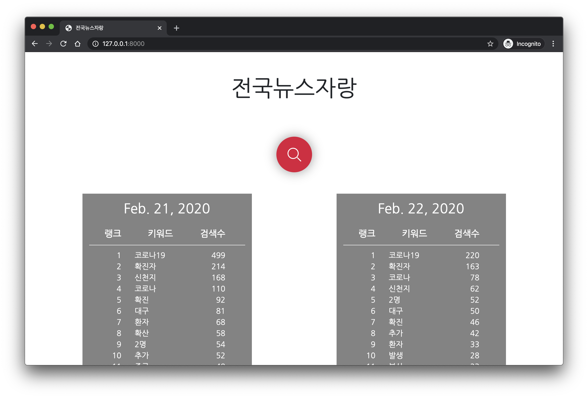
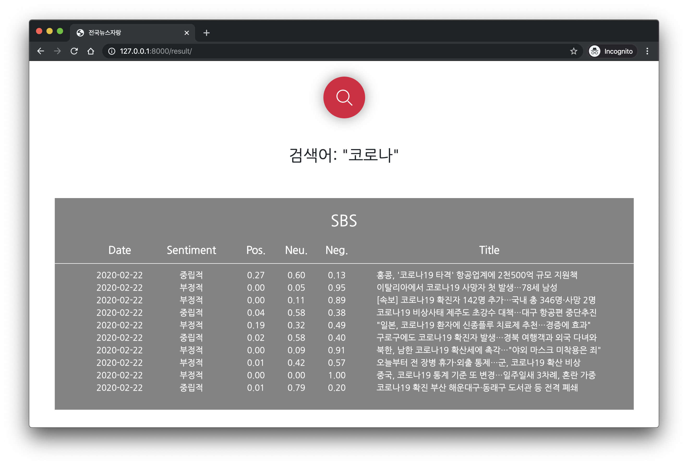
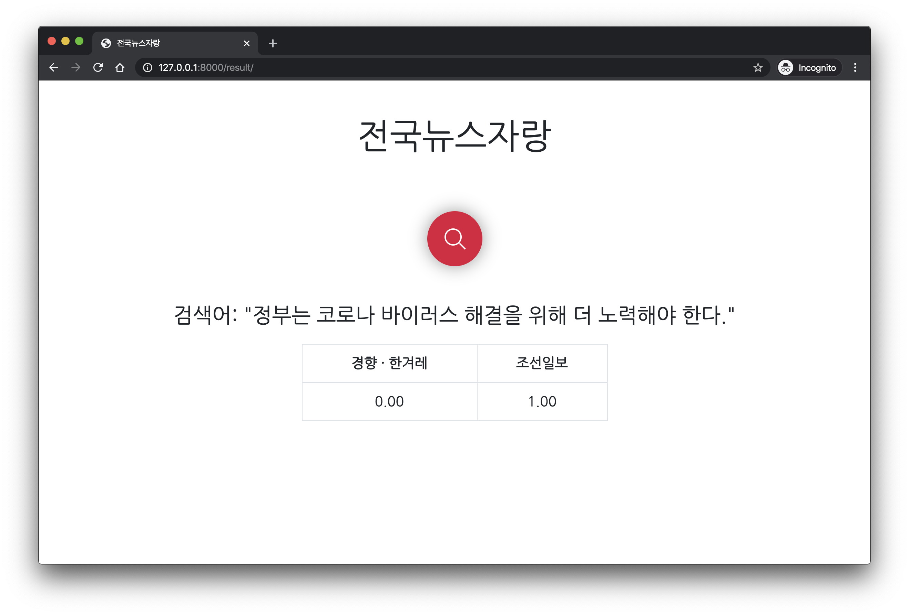

# 언론사 편향성을 고려한 뉴스 트렌드 분석 시스템

본 코드 저장소는 KPMG Ideathon에 참가한 씨그램(Seagram) 팀의 작업 공간입니다. 본 프로젝트의 주제는
언론사 편향성을 고려하는 뉴스 트렌드 분석 시스템을 개발하고 프로토타입을 직접 구현하는 것입니다.

## 개요

뉴스 트렌드를 파악하는 것은 모든 기업 및 기관에서 중요하게 다루는 문제입니다. 그러나, 현재까지 개발된 뉴스
트렌드 분석 서비스는 한국의 언론사 편향성을 고려하지 않는다는 문제점을 가지고 있습니다. 예를 들어 대표적인
국내 언론사인 조선일보와 한겨레는 동일한 사건에 대해 전혀 다른 방향으로 보도하는 경우가 많습니다. 다음
예제는 2020년 2월 21일에 네이버 메인에 올라온, 코로나 19 바이러스와 문재인 대통령에 대한 두 언론사의
기사를 가져 온 것입니다. 이러한 편항성을 고려하지 않는다면 분석 시스템 자체의 성능이 좋더라도 결과적으로
대중과 언론의 생각을 잘못 파악할 가능성이 높습니다.
- **조선일보:** `대통령 부부, 이시국에 '파안대소'… 일부 네티즌 비판`
- **한겨레:** `문 대통령 “상황 엄중, 빠르고 강력한 대책 시행”`

저희는 본 프로젝트에서 언론사 편향성을 고려하는 새로운 뉴스 트렌드 분석 시스템을 제안하고, 이를 홈페이지
형태로 구현한 프로토타입을 제작합니다. 본 시스템이 지원하는 기능은 다음과 같습니다.
- **핵심 키워드 검색**: 최근에 많은 언론사에서 다루고 있는 핵심 키워드 찾기
- **언론사 편향성 분석**: 입력한 키워드에 대해 각 언론사의 긍정/부정 반응도 계산하기
- **문장 편향성 분석**: 임의의 문장에 대한 언론사 편향성 계산하기

### 핵심 인공지능 기술

본 프로젝트는 딥 러닝(deep learning) 및 자연어 처리(natural language processing) 분야의
기술을 기반으로 하고 있습니다. 핵심적으로 사용하는 인공지능 기술 및 패키지는 다음과 같습니다. 

- [**Google Sentencepiece**](https://github.com/google/sentencepiece): Google의 최신
자연어 처리 모델입니다. 형태소 등 언어에 대한 지식 없이도 문장 내 등장 패턴을 기반으로 주어진 문장을 여러
개의 토큰으로 쪼갤 수 있습니다. 최근에 다양한 자연어 처리 문제에서 뛰어난 성능을 보인 Google의
[BERT](https://arxiv.org/abs/1810.04805) 모델도 비슷한 방식의 토큰 모델을 사용하였습니다.

- [**Microsoft Azure Text Analytics**](https://azure.microsoft.com/en-us/services/cognitive-services/text-analytics/):
Microsoft Azure에서 지원하는 자연어 분석 시스템입니다. 임의의 문장을 입력하면 해당 문장의 논조를
분석하여 감정 분석을 진행합니다. 많은 양의 텍스트 데이터에 대해 훈련된 인공지능 모델을 사용하기 때문에
특정 분야에 대한 전문 지식 없이도 좋은 성능을 보인다는 장점이 있습니다.

- [**Long Short-Term Memory Unit (LSTM)**](https://en.wikipedia.org/wiki/Long_short-term_memory):
LSTM 모델은 시계열 데이터에 최적화된 딥 러닝 모델입니다. 일반적인 전방 전달 신경망(feedforward
neural network)이 모든 입력 피처를 동일한 수준으로 취급하는 것에 비해, LSTM 모델은 내부적인 상태
벡터를 유지하며 시계열 내의 개별 입력이 주어질 때마다 순차적으로 정보를 누적합니다.

## 시스템 구조

본 프로토타입은 저희가 직접 수집한 3만 개 이상의 뉴스 데이터를 이용하여 인공지능 모델을 학습합니다. 각
기능은 다음과 같은 기술적 요소로 이루어져 있습니다.

### 데이터 정보

본 프로젝트에서 사용하는 뉴스 데이터는 RSS 서비스를 이용해 저희 팀이 직접 수집한 것입니다. 개인 Linux
서버에서 일 분에 한 번 전체 기사의 언론사, 제목, 그리고 요약문을 가져와 MySQL 데이터베이스에 저장합니다.
테스트를 마친 후 2월 12일부터 정상적인 스크래핑을 시작하였고 2020년 2월 21일 기준으로 데이터베이스에
저장된 기사 수는 약 3만 6천 개입니다. 각 기사는 다음과 같은 형식으로 저장됩니다.
- `2020-02-12 13:44:24`, `조선일보`, `“봉준호 감독 미국서 유명해요?”...봉준호 아들이 들은말`, ...

### 핵심 키워드 탐색

최근 핫 키워드를 탐색하는 기능은 크게 두 가지 요소로 이루어집니다. 먼저, 데이터베이스 내의 모든 기사
제목을 받아 와 전처리를 실행합니다. 키워드 탐색은 주로 명사를 목표로 하고, 기사 제목에서는 대부분의 명사가
띄어쓰기로 구분되어 있기 때문에 복잡한 형태소 분석기를 사용하지 않고 간단한 휴리스틱(heuristic) 기반의
전처리 함수를 구현하여 사용합니다. 그런 다음, 키워드별로 최근 N일 동안의 등장 횟수를 센 다음 횟수가 가장
큰 순서로 나열합니다. 저희는 실험을 통해 이런 단순한 기법이 복잡한 형태소 분석기를 사용했을 때보다 더욱
직관적이고 정성적으로 더 나은 결과로 이어진다는 것을 확인하였습니다.

### 기사 논조 분석

저희는 특정 키워드에 대한 언론사 편향성을 계산하기 위해 Microsoft Azure Text Analytics 서비스를
활용하였습니다. 해당 서비스는 개별 문장이 입력되었을 때 문장의 논조나 감정을 긍정, 중립, 부정에 대한
점수로 출력해 줍니다. 먼저, 특정 키워드가 주어졌을 때 해당 키워드를 포함하는 모든 기사를 검색합니다.
그런 다음, API를 통해 각 기사 제목의 논조를 세 가지 감정에 대한 점수로 계산합니다. 일반적으로 기사의
제목은 중립적이라고 생각하기 쉬우나, 저희는 실험을 통해 많은 수의 기사가 부정적인 감정을 내포하고 있으며
특정 대상을 비판하는 방식으로 쓰인다는 것을 확인하였습니다. 이렇게 수집된 기사와 논조를 먼저 언론사에 대해
분류한 뒤 각 언론사의 주 논조를 출력합니다.

### 문장 편향성 분석

저희는 언론사 편향성을 보다 심도 깊게 분석하기 위해 *문장 편향성 분석* 모델을 개발하였습니다. 이 모델은
임의의 문장이 입력으로 주어졌을 때 해당 문장의 편향성을 언론사별 점수로 계산합니다. 예를 들어, 우리 나라의
대표 언론사 중 조선일보, 경향신문, 그리고 한겨레를 보수(조선일보) 성향과 진보(경향신문과 한겨레) 성향으로
나누어 모델을 학습한다면, 본 모델은 보수 성향 점수와 진보 성향 점수를 백분위로 계산합니다. 예를 들면
임의의 문장에 대해 실제로 모델을 실행한 결과가 다음과 같이 나타났습니다.
- \[보수 100.0%\] `정부는 코로나 바이러스 해결을 위해 더 노력해야 한다.`
- \[진보 100.0%\] `정부는 코로나 바이러스 대처를 잘 하고 있다.`

모델 학습 과정은 다음과 같습니다. 먼저, Google의 최신 NLP 모델인 Sentencepiece 모델을 활용하여
각 문장을 여러 개의 토큰으로 나눕니다. 이때 각 토큰에 대해 임베딩(embedding) 벡터를 입력으로 받는
LSTM 모델을 학습합니다. LSTM 모델은 시계열 데이터를 모델링할 수 있는 딥 러닝 모델으로서, 각 토큰의
단어를 바탕으로 토큰간 관계를 내부 파라미터 형태로 학습합니다. 모델 설계를 마친 다음에는 각 기사의 출판
언론사를 학습 라벨로 활용하여 배치 단위의 학습을 진행합니다. 최적화 모델로는 [Adam](https://arxiv.org/abs/1412.6980)
알고리즘을 사용하였습니다. 

## 코드 실행 방법

전체 코드는 Python 3.6 언어로 작성되어 있으며 프로토타입 웹페이지는 Django 프레임워크를 기반으로
구현되어 있습니다. 프로토타입을 실행하기 위해 다음과 같은 명령어를 실행해야 합니다. 그런 다음, Chrome
등의 인터넷 브라우저를 실행하여 `127.0.0.1:8000` 주소에 접속하면 현재 핫 키워드를 볼 수 있을 뿐
아니라 원하는 키워드 및 문장을 검색하여 언론사 편향성을 분석할 수 있습니다. 

```
pip install -r requirements.txt
cd src/webpage
python manage.py runserver
```

하지만, 본 프로토타입이 현재 저희 개인 서버의 MySQL 데이터베이스 및 Microsoft Azure API를 기반으로
하고 있으므로 공개된 코드 저장소에 이러한 개인 정보를 공개하는 것은 어렵습니다. 따라서, 코드를 실행하기
전에 다음 세 개의 파일을 `data` 폴더에 먼저 위치시켜야 합니다.
- `azure_info.json`: 저희 팀의 MS Azure API에 대한 정보입니다.
- `db_info.json`: 전체 뉴스 데이터를 저장하고 있는 저희 팀의 MySQL DB 정보입니다.
- `web_secret.json`: Django 홈페이지를 구동하기 위한 key 정보입니다.  
 
## 데모 실행 결과
 
프로토타입을 실행한 결과를 간단하게 본 저장소에 첨부합니다. 다음 그림은 홈페이지에 접속하자마자 나타나는
화면입니다. 접속 날짜 기준으로 당일과 그 전날의 핫 키워드 목록을 출력합니다. 검색 버튼을 클릭하면 원하는
키워드나 문장을 검색하여 언론사 편향성을 분석할 수 있습니다.
 
<p align="center">
    
</p>
 
다음 그림은 `코로나`라는 키워드를 검색한 결과입니다. 대표적으로 SBS의 보도 결과 10개를 출력하였습니다.
총 10개의 기사 중 6개의 기사가 부정적인 논조를 띠고 있음을 알 수 있습니다. 홈페이지의 스크롤을 내리면
다른 언론사의 결과 또한 나타나 있습니다.
 
<p align="center">
    
</p>
 
다음 그림은 단어가 아닌 문장을 검색함으로써 언론사별 편향도 점수를 계산한 결과입니다. 검색창에 세 개
이상의 단어로 이루어진 문장을 검색하면 키워드 검색이 아닌 문장 검색으로 자동으로 전환됩니다. 인공지능
기술을 기반으로 임의의 문장을 처리할 수 있습니다.
 
<p align="center">
    
</p>
 
## 팀 멤버

본 코드 저장소는 씨그램(Seagram) 팀의 다음 네 명의 멤버가 함께 작성하였습니다.

- 유재민 (leader, jaeminyoo@snu.ac.kr)
- 김정훈 (joseph.junghoon.kim@gmail.com)
- 조민용 (chominyong@gmail.com)
- 이성민 (ligi214@snu.ac.kr)
